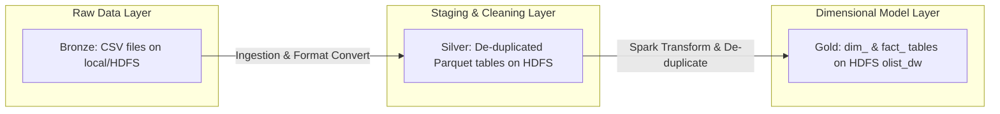

# Olist E-Commerce Data Warehouse — Phase 2 Report

This report presents the theoretical and practical study of Phase 2, focusing on data quality, dimensional modeling (Star Schema), architectural choices (ETL vs. ELT, dbt), and analytics mapping for the Olist Brazilian E-Commerce dataset.

---

## 1. Data Cleanliness & Geolocation Duplicate Analysis

### What Does "Clean Data" Mean?
Data cleanliness (or quality) is measured across five major dimensions:
1. **Uniqueness**: No redundant records representing the same real-world entity.
2. **Completeness**: No missing critical attributes (non-null identifiers).
3. **Consistency**: No conflicting information across tables or rows.
4. **Accuracy**: Values accurately reflect real-world metrics (e.g., valid coordinates, positive prices).
5. **Validity**: Data conforms to the expected format, type, and schema constraints.

### Duplicate Analysis Findings
Using our Spark duplicate checking script, we analyzed the raw tables:
- **`geolocation`**: **261,831 duplicate rows** out of 1,000,163 total rows.
- **All other tables**: **0 duplicate rows** (perfect unicity).

In the `geolocation` table, multiple rows share the same postal code prefix (`geolocation_zip_code_prefix`) with slight variations in coordinates (or exact duplicates). If left uncleaned, joining dimensions or facts to geolocation on zip codes would result in a **cartesian explosion** (patlama), artificially duplicating sales records, revenues, and counts.

### De-duplication Strategy
To resolve this, we implemented a Spark aggregation strategy in [transform.py](file:///c:/Users/asus/Desktop/Projeler/analytics-platform/BigData-Pipeline-Project/processing/transform.py):
- Group rows by `geolocation_zip_code_prefix`.
- Calculate the mathematical average (`AVG`) of `geolocation_lat` and `geolocation_lng` to get a single centroid coordinate for each zip code.
- Select the first occurrence (`FIRST`) of `geolocation_city` and `geolocation_state`.
- This reduces the table to one row per zip code prefix, ensuring safe 1-to-1 or N-to-1 joins.

---

## 2. ETL vs. ELT & dbt (Data Build Tool) Analysis

| Feature | ETL (Extract-Transform-Load) | ELT (Extract-Load-Transform) |
|---|---|---|
| **Processing Site** | Separate staging/engine (e.g., Spark cluster) | Target storage/warehouse (e.g., Snowflake, BigQuery) |
| **Data Flow** | Transform *before* loading into the final warehouse | Load raw data into warehouse *before* transforming |
| **Scalability** | High, decoupled from the warehouse compute | Extremely high, utilizes cloud DW horsepower |
| **Use Case** | Complex joins, data cleaning, heavy compute jobs | Modern cloud DW setups with structured/semi-structured data |

### Why We Adopted ETL for This Pipeline
We chose the **ETL** approach utilizing **Apache Spark** for the following reasons:
1. **Spark Engine Capabilities**: Apache Spark is designed for high-performance memory-based distributed transformations. It handles the de-duplication of 1M geolocation rows and multi-table joins exceptionally fast.
2. **ThriftServer Limits**: The Spark ThriftServer is a single-session JDBC gateway. Offloading the transformation load from ThriftServer keeps it highly responsive for Superset user queries.
3. **Storage Efficiency**: Converting and structuring raw Parquet into a Star Schema *before* registering it as tables saves storage overhead and prevents corrupt or duplicate tables from entering the queryable analytics database.

### What is dbt and How Could We Integrate It?
**dbt (data build tool)** is a transformation workflow tool that allows teams to write SQL `SELECT` statements and automatically structures them into tables and views within a database. It manages dependencies, builds documentation, and runs data quality tests.

#### Integration into Our Pipeline:
If we were to integrate dbt in this project:
1. **Execution**: dbt would run *after* the raw CSVs are loaded as Spark SQL tables in the `olist` database.
2. **Models**: We would define SQL files for each dimension and fact table. For example, `dim_customers.sql` would contain the SELECT query joining customers and cleaned geolocation.
3. **Compilation**: dbt would compile the queries and execute them on the Spark ThriftServer or a Postgres warehouse, writing the results into `olist_dw`.
4. **Data Quality Tests**: We could define schema tests in `schema.yml` to verify that `customer_id` is unique and `item_revenue` is always positive.

---

## 3. Architectural Layers

Our pipeline implements a three-tier Lakehouse/Data Warehouse architecture:



1. **Bronze (Raw/Staging)**: Raw Olist CSV files. No modifications, direct representation of source data.
2. **Silver (Cleaned/Conformed)**: Normal Parquet datasets stored in HDFS. Character sets are normalized, column types are inferred, and invalid formatting is resolved.
3. **Gold (Dimensional/Warehouse)**: The `olist_dw` database containing Star Schema tables (Fact & Dimensions). This layer is fully optimized for BI tools and end-user analytical queries.

---

## 4. Star Schema Design & Mappings

The Star Schema separates metrics (Facts) from descriptive attributes (Dimensions) to optimize analytical queries.

### Dimensional Entity Schema

```text
                  +-------------------------+
                  |       dim_orders        |
                  +-------------------------+
                  | PK  order_id            |
                  |     order_status        |
                  |     purchase_timestamp  |
                  +-------------------------+
                               |
                               | 1..N
                               v
+------------------+     +--------------------------+     +------------------+
|  dim_customers   |     |     fact_order_items     |     |   dim_products   |
+------------------+     +--------------------------+     +------------------+
| PK  customer_id  |1..N | PK  order_item_key       | 1..N| PK  product_id   |
|     city         |---->| FK  order_id             |<----|     category_name|
|     state        |     | FK  product_id           |     |     category_eng |
+------------------+     | FK  seller_id            |     +------------------+
                         | FK  customer_id          |
                         |     price                |
                         |     freight_value        |
                         |     item_revenue         |
                         |     delivery_time_days   |
                         |     review_score         |
                         +--------------------------+
                               ^              ^
                          1..N |              | 1..N
                               |              |
                  +------------------+  +------------------+
                  |   dim_sellers    |  |   dim_payments   |
                  +------------------+  +------------------+
                  | PK  seller_id    |  | FK  order_id     |
                  |     city         |  |     payment_type |
                  |     state        |  |     payment_value|
                  +------------------+  +------------------+
```

### Business Question Mappings to Star Schema

The following table demonstrates how our Star Schema structure answers the 7 key business questions:

| Business Question | Fact Table Metric | Dimension Table Attributes | Query Strategy |
|---|---|---|---|
| **1. Monthly revenue** | `fact_order_items.item_revenue` | `dim_orders.order_purchase_timestamp` | Sum `item_revenue` grouped by month of `order_purchase_timestamp`. |
| **2. Revenue by product category** | `fact_order_items.item_revenue` | `dim_products.product_category_name_english` | Sum `item_revenue` grouped by `product_category_name_english`. |
| **3. Top-performing sellers** | `fact_order_items.item_revenue` | `dim_sellers.seller_id` | Sum `item_revenue` grouped by `seller_id` sorted descending. |
| **4. Sales by customer state** | `fact_order_items.item_revenue` | `dim_customers.customer_state` | Sum `item_revenue` grouped by `customer_state`. |
| **5. Average delivery time by state** | `fact_order_items.delivery_time_days` | `dim_customers.customer_state` | Average `delivery_time_days` grouped by `customer_state`. |
| **6. Payment method trends** | `dim_payments.payment_value` | `dim_orders.order_purchase_timestamp`, `dim_payments.payment_type` | Sum `payment_value` grouped by month of `order_purchase_timestamp` and pivot on `payment_type`. |
| **7. Average review score by category** | `fact_order_items.review_score` | `dim_products.product_category_name_english` | Average `review_score` grouped by `product_category_name_english`. |
